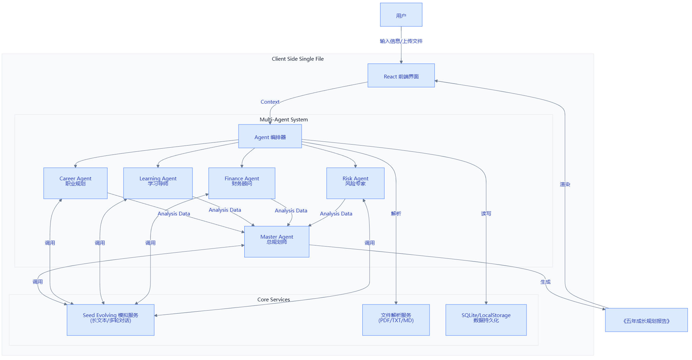

# 🧭 AI 人生规划师

> 基于 Seed Evolving 大模型的智能人生规划系统 —— 多 Agent 协作，为你生成科学、可执行的未来五年成长规划

<p align="center">
  
  
  
  
  
  
</p>

---

## 📸 系统架构



整体采用分层架构：
- **前端层**：React + Neumorphism 新拟态 UI，用户信息自动保存到 localStorage
- **多 Agent 系统**：编排器调度 5 位专家协作，分析结果汇聚到总规划师
- **核心服务层**：Seed Evolving 大模型提供推理能力，文件解析支持 PDF/Word/TXT/Markdown
- **数据层**：SQLite 持久化 + localStorage 本地缓存

---

## ✨ 核心特性

### 🧠 百万级上下文理解
- 支持上传和解析 PDF、Word (DOCX)、TXT、Markdown 多种文件格式
- 综合分析简历、学习记录、项目经历、笔记、目标规划
- 基于关键词的智能检索（向量检索可扩展）

### 👥 5 个 AI 专家 Agent 协作
| Agent | 角色 | 职责 |
|-------|------|------|
| 👔 **职业规划专家** | Career Agent | 分析职业定位、优势短板、发展路线 |
| 📚 **学习成长导师** | Learning Agent | 制定学习计划、技能差距分析、推荐资源 |
| 💰 **财务规划专家** | Finance Agent | 收入增长路径、副业方向、商业化建议 |
| ⚠️ **风险挑战专家** | Risk Agent | 反方角色，审查漏洞、指出风险、质疑假设 |
| 👑 **人生总规划师** | Master Agent | 综合所有专家意见，生成最终规划报告 |

工作流程：**专家独立分析 → 风险专家质疑 → 总规划师综合输出**，模拟真实决策过程，避免单一视角偏见。

### 📋 完整规划输出
- **个人能力画像**：6 维度能力评分、核心优势、待改进领域、独特价值定位
- **五年成长路线图**：2026-2030 每年的主题、学习/项目/职业目标、季度里程碑
- **12 个月详细行动计划**：月度主题、周目标、交付物、成功指标
- **风险提醒与预案**：识别潜在风险、制定应急预案、现实认知检查
- **每日执行指南**：早/中/晚习惯建议、需要养成/避免的习惯、周度复盘

### 📈 长期成长陪伴
- 每日成长记录：学习时长、代码行数、阅读数量
- AI 教练实时反馈：完成度分析、亮点、改进建议、明日行动
- 成长趋势统计：连续打卡、累计数据追踪

### 🎨 精致 UI 设计
- Neumorphism 新拟态设计风格，柔和立体
- 流畅的交互动画和微反馈
- 响应式布局，支持移动端

---

## 🚀 快速开始

### 前置要求
- Python 3.8+
- Node.js 18+
- Seed Evolving API Key（火山引擎方舟平台）

### 后端启动

```bash
cd backend

# 创建虚拟环境
python -m venv venv
# Windows: venv\Scripts\activate
source venv/bin/activate

# 安装依赖
pip install -r requirements.txt

# 配置环境变量
# 编辑 .env 文件，填入 SEED_API_KEY 和 SEED_API_BASE_URL

# 启动服务
python run_server.py
```

后端将在 `http://localhost:8000` 启动，API 文档访问 `http://localhost:8000/docs`

### 前端启动

```bash
cd frontend

# 安装依赖
npm install

# 启动开发服务器
npm run dev
```

前端将在 `http://localhost:3000` 启动

---

## ⚙️ 环境变量配置

在 `backend/.env` 文件中配置：

| 变量名 | 说明 | 示例 |
|--------|------|------|
| `SEED_API_KEY` | **必填** Seed Evolving API 密钥 | `ark-xxx...` |
| `SEED_API_BASE_URL` | API 端点 | `https://ark.cn-beijing.volces.com/api/plan` |
| `SEED_MODEL` | 模型名称 | `doubao-seed-evolving` |
| `DATABASE_URL` | 数据库连接 | `sqlite+aiosqlite:///./data/ai_life_planner.db` |
| `DEBUG` | 调试模式 | `false` |

---

## 💡 使用提示

- **快速体验**：项目根目录 `test-data/sample_resume.md` 提供了一份示例简历，填写信息时可直接上传此文件快速体验
- **自动保存**：填写的个人信息会自动保存到浏览器本地存储（localStorage），刷新页面或关闭浏览器后再次打开不会丢失，无需重复填写
- **生成耗时**：点击"开始五年规划"后，5 位 AI 专家会依次进行分析（职业规划→学习成长→财务评估→风险审查→综合报告），完整生成报告大约需要 **5-8 分钟**，进度会实时显示在页面上

---

## 📁 项目结构

```
ai-life-planner/
├── backend/                 # FastAPI 后端
│   ├── agents/              # 5个 Agent 实现
│   │   ├── base.py
│   │   ├── career_agent.py
│   │   ├── learning_agent.py
│   │   ├── finance_agent.py
│   │   ├── risk_agent.py
│   │   ├── master_agent.py
│   │   └── orchestrator.py  # Agent 编排器
│   ├── routes/              # API 路由
│   ├── services/            # LLM、文件解析、向量检索
│   ├── database/            # 数据库模型和连接
│   ├── models/              # Pydantic 数据模型
│   └── run_server.py
├── frontend/                # React 前端
│   ├── src/
│   │   ├── components/      # 通用组件
│   │   ├── pages/           # 页面
│   │   └── services/        # API 封装
│   └── package.json
├── docs/
│   └── architecture.png     # 系统架构图
└── test-data/
    └── sample_resume.md     # 示例简历
```

---

## 🛠️ 技术栈

**后端**
- FastAPI - 异步 Web 框架
- SQLAlchemy + aiosqlite - 异步 ORM
- httpx - 异步 HTTP 客户端
- Seed Evolving (Anthropic 兼容 API) - 大模型推理
- PyMuPDF - PDF 解析
- python-docx - Word 文档解析

**前端**
- React 18 - UI 框架
- React Router - 路由
- Tailwind CSS - 原子化 CSS
- Vite - 构建工具
- Lucide React - 图标库
- Axios - HTTP 客户端

---

---

<p align="center">
  Powered by <strong>Seed Evolving</strong> · 多 Agent 智能协作
</p>

## 📄 License

MIT
